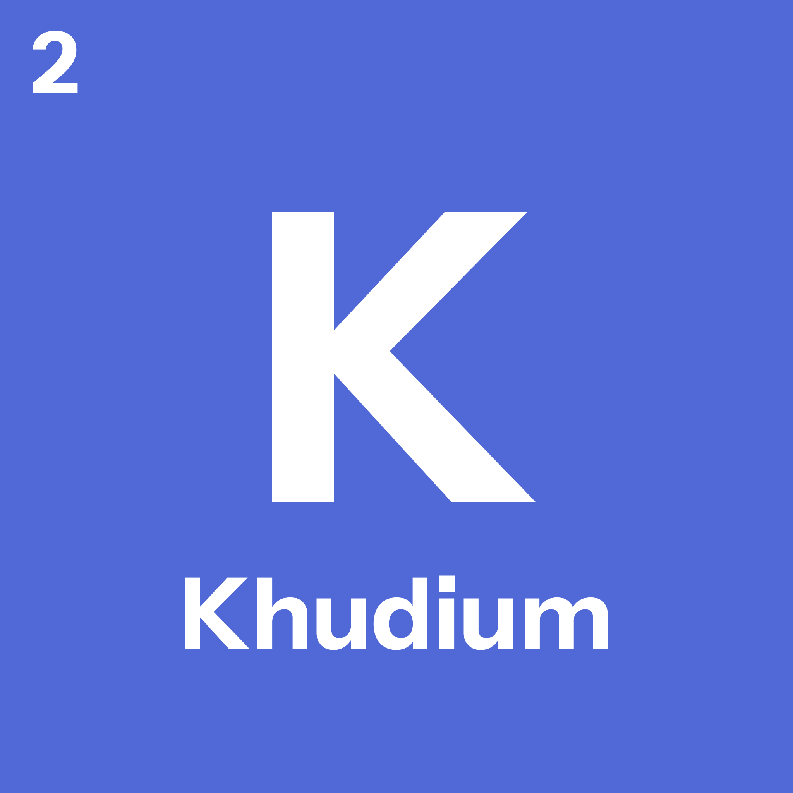

<p align="center">
  
</p>

<h1 align="center">Khudium</h1>

<p align="center">
  <strong>Khudium</strong> is an anodized keyboard and mouse overlay for Wayland.
</p>

---

## Install

```bash
cargo install --path .
```

---

## Quick start

```bash
khudium --mouse --scale 0.9 --alpha 0.8
```

---

## Docs
- [Usage](docs/USAGE.md)
- [Adding layouts](docs/LAYOUTS.md)

